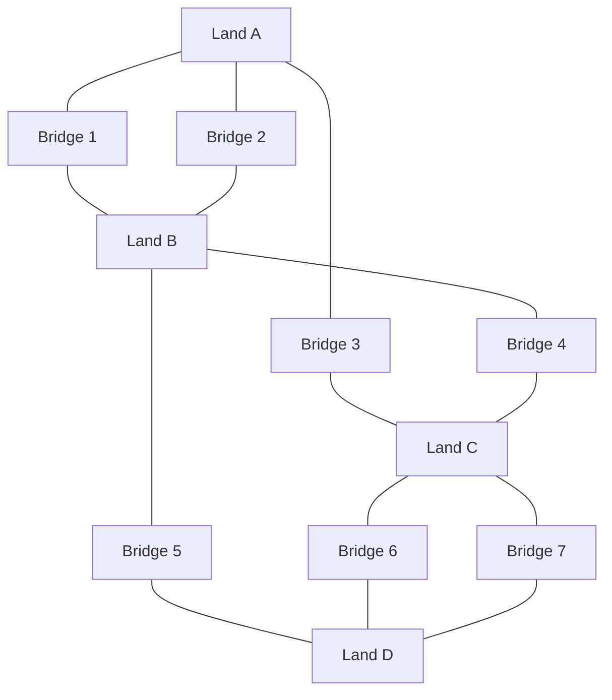
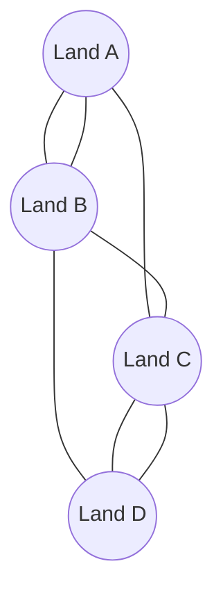
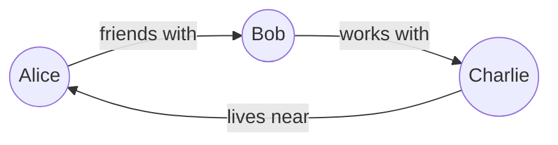

# 🌉 From Seven Bridges to Graph Databases
## A Journey Through Connected Data


## 🎭 Once Upon a Time...

### The Seven Bridges Problem


In 1736, a mathematician named Leonhard Euler faced an interesting puzzle:
- Could someone walk through the city of Königsberg...
- Crossing each of its seven bridges...
- Exactly once?

### 💡 Euler's Brilliant Insight
Instead of looking at the physical map, Euler did something revolutionary:

1. He turned land areas into **dots** (now called nodes)
2. He turned bridges into **lines** (now called edges)
3. He created the world's first **graph**!



## 🚀 Fast Forward to Today...

### Modern Graph Databases Work the Same Way!

#### Real-World Example: Social Network


Just like Euler's bridges:
- People are **nodes** (dots)
- Relationships are **edges** (lines)
- Everything is connected!

## 🔄 From History to Modern Tech

### Euler's Graph vs. Modern Graph Database

| Euler's Time | Modern Databases |
|--------------|------------------|
| Land Areas (Dots) | People, Places, Things (Nodes) |
| Bridges (Lines) | Relationships, Connections (Edges) |
| Paper Maps | Computer Storage |
| Manual Checking | Fast Traversal |

## 🎯 Why This Matters Today

### 1. Social Networks
```
You --friends--> Alice --friends--> Bob
```
Just like Euler's bridges connecting land!

### 2. Navigation Apps
```
Home --2 miles--> Store --1 mile--> Park
```
Still solving bridge-like problems!

### 3. Recommendations
```
You --bought--> Book1 <--bought-- Other People --bought--> Book2
```
Finding paths through connected data!

## 🎮 Try It Yourself!

### Create Your First Graph (Just Like Euler!)
```cypher
// Create two places
CREATE (home:Place {name: 'Home'})
CREATE (store:Place {name: 'Store'})

// Connect them with a road
CREATE (home)-[:ROAD {distance: '2 miles'}]->(store)
```

## 🌟 Key Takeaways

1. **Everything is Connected**
   - Just like Euler's bridges connected land
   - Modern data connects people, places, things

2. **Relationships Matter**
   - Euler cared about bridges
   - We care about friendships, roads, similarities

3. **Visual Thinking Helps**
   - Euler drew graphs
   - We use graph databases

## 📚 Learning Path

1. **Start with History**
   - Understand Euler's problem
   - See how he solved it

2. **Move to Modern**
   - Learn about graph databases
   - Try simple examples

3. **Build Something**
   - Create your own graph
   - Solve real problems

## 🤝 Join the Journey

- Share your learning experience
- Try solving modern "bridge problems"
- Connect with others learning graphs

## 💭 Remember

When you're working with graph databases, you're building on ideas that started with a guy trying to cross some bridges! 

---
Made with 💝 by learners, for learners

Remember: Every graph database expert started by learning about nodes and edges, just like you are now!
