# 🌉 The Seven Bridges Story: Understanding Graphs Through Memory Hooks

## 📖 The Historical Story

Imagine walking through the beautiful city of Königsberg in 1736. The challenge that puzzled everyone:
**Could you walk across all seven bridges exactly once?**

```mermaid
graph TD
    subgraph "The City of Königsberg"
    A[Island A 🏝️] --- B1[Bridge 1] --- B[Riverbank B 🏖️]
    A --- B2[Bridge 2] --- B
    A --- B3[Bridge 3] --- C[Island C 🏝️]
    B --- B4[Bridge 4] --- C
    B --- B5[Bridge 5] --- D[Riverbank D 🏖️]
    C --- B6[Bridge 6] --- D
    C --- B7[Bridge 7] --- D
    end

    style A fill:#f9f,stroke:#333,stroke-width:4px
    style B fill:#f9f,stroke:#333,stroke-width:4px
    style C fill:#f9f,stroke:#333,stroke-width:4px
    style D fill:#f9f,stroke:#333,stroke-width:4px
```

## 🧠 Memory Hooks for Understanding Graphs

### 1. Think of Nodes as "Places You Love" 🏠

```mermaid
graph TD
    subgraph "Your Special Places"
    Home[🏠 Your Home]
    School[🏫 School]
    Park[🌳 Park]
    Store[🏪 Store]
    end

    style Home fill:#f9f,stroke:#333,stroke-width:4px
    style School fill:#f9f,stroke:#333,stroke-width:4px
    style Park fill:#f9f,stroke:#333,stroke-width:4px
    style Store fill:#f9f,stroke:#333,stroke-width:4px
```

**Memory Hook**: Just like your favorite places are important spots in your life, nodes are important points in a graph.

### 2. Think of Relationships as "Ways to Get There" 🚶‍♂️

```mermaid
graph LR
    subgraph "Your Daily Routes"
    Home[🏠 Home] --Walk--> School[🏫 School]
    School --Bus--> Park[🌳 Park]
    Park --Bike--> Store[🏪 Store]
    Store --Walk--> Home
    end

    style Home fill:#f9f,stroke:#333,stroke-width:4px
    style School fill:#f9f,stroke:#333,stroke-width:4px
    style Park fill:#f9f,stroke:#333,stroke-width:4px
    style Store fill:#f9f,stroke:#333,stroke-width:4px
```

**Memory Hook**: Just like routes connect your favorite places, relationships connect nodes.

## 🎯 Real-Life Examples to Remember

### 1. Your Social World 👥

```mermaid
graph TD
    subgraph "Your Social Network"
    You[👤 You] --"Best Friend"--> Friend1[👥 Best Friend]
    You --"Sister"--> Sister[👧 Sister]
    You --"Teacher"--> Teacher[👩‍🏫 Teacher]
    Friend1 --"Classmate"--> Sister
    end

    style You fill:#bbf,stroke:#333,stroke-width:4px
    style Friend1 fill:#bbf,stroke:#333,stroke-width:4px
    style Sister fill:#bbf,stroke:#333,stroke-width:4px
    style Teacher fill:#bbf,stroke:#333,stroke-width:4px
```

**Memory Hook**: Think of your friends as nodes and your friendships as relationships!

### 2. Your Family Tree ❤️

```mermaid
graph TD
    subgraph "Your Family"
    GP[👴 Grandpa] --"married to"--> GM[👵 Grandma]
    GP --"father of"--> Dad[👨 Dad]
    GM --"mother of"--> Dad
    Dad --"father of"--> You[😊 You]
    end

    style GP fill:#fbb,stroke:#333,stroke-width:4px
    style GM fill:#fbb,stroke:#333,stroke-width:4px
    style Dad fill:#fbb,stroke:#333,stroke-width:4px
    style You fill:#fbb,stroke:#333,stroke-width:4px
```

**Memory Hook**: Your family tree is a graph where family members are nodes and relationships show how you're connected!

## 🎮 Fun Ways to Remember

### 1. The Instagram Analogy 📱

```mermaid
graph LR
    subgraph "Instagram Network"
    Post[📸 Post] --"liked by"--> Friend[👤 Friend]
    You[😊 You] --"posted"--> Post
    You --"follows"--> Friend
    end

    style Post fill:#bfb,stroke:#333,stroke-width:4px
    style Friend fill:#bfb,stroke:#333,stroke-width:4px
    style You fill:#bfb,stroke:#333,stroke-width:4px
```

**Memory Hook**: Every time you use Instagram, you're navigating a graph!

### 2. The School Building 🏫

```mermaid
graph TD
    subgraph "Your School"
    CR1[🚪 Classroom 1] --"hallway"--> CR2[🚪 Classroom 2]
    CR2 --"stairs"--> Lab[🔬 Lab]
    Lab --"corridor"--> Cafe[🍽️ Cafeteria]
    Cafe --"hallway"--> CR1
    end

    style CR1 fill:#bbf,stroke:#333,stroke-width:4px
    style CR2 fill:#bbf,stroke:#333,stroke-width:4px
    style Lab fill:#bbf,stroke:#333,stroke-width:4px
    style Cafe fill:#bbf,stroke:#333,stroke-width:4px
```

**Memory Hook**: Your school is a graph where rooms are nodes and hallways are relationships!

## 🎯 Practice to Make It Stick

### Try This Mental Exercise:
1. Look around your room right now
2. Identify 5 objects (these are your nodes)
3. Think about how they're related (these are your relationships)

```mermaid
graph TD
    subgraph "Your Room Right Now"
    Desk[💻 Desk] --"holds"--> Laptop[💻 Laptop]
    Desk --"next to"--> Bed[🛏️ Bed]
    Bed --"has"--> Pillow[🛏️ Pillow]
    Desk --"near"--> Chair[🪑 Chair]
    end

    style Desk fill:#f9f,stroke:#333,stroke-width:4px
    style Laptop fill:#f9f,stroke:#333,stroke-width:4px
    style Bed fill:#f9f,stroke:#333,stroke-width:4px
    style Pillow fill:#f9f,stroke:#333,stroke-width:4px
    style Chair fill:#f9f,stroke:#333,stroke-width:4px
```

## 🗝️ Key Takeaways to Remember

1. **Nodes are like Places** 🏠
   - Your home in a city
   - Your profile on Instagram
   - A person in your family

2. **Relationships are like Paths** 🛣️
   - Roads between places
   - Friendships between people
   - Lines between dots

## 💡 Final Memory Hook

Every time you:
- Open Instagram (You're using a graph!)
- Visit friends (You're traversing a graph!)
- Walk to school (You're following a graph!)

Remember: The bridges of Königsberg were just like the paths in your life, connecting the important points (nodes) in your journey! 

---
*Note: This guide combines visual learning with memory techniques to help you understand and remember graph concepts naturally!*
