# 📊 Graph Characteristics and Traversal: A Complete Guide

## 📑 Table of Contents
1. [Types of Graphs](#types-of-graphs)
2. [Graph Properties](#graph-properties)
3. [Graph Traversal](#graph-traversal)
4. [Real-World Applications](#applications)
5. [Advanced Concepts](#advanced)
6. [Practice Examples](#practice)

## Types of Graphs {#types-of-graphs}

### 1. Directed vs. Undirected Graphs

```mermaid
graph LR
    subgraph "Undirected Graph (Marriage Example)"
        Ali1[👨 Ali] --- Ayesha1[👩 Ayesha]
    end
    
    subgraph "Directed Graph (Social Media Following)"
        Ali2[👨 Ali] -->|follows| Ayesha2[👩 Ayesha]
        Ayesha2 -.->|may or may not follow back| Ali2
    end

    style Ali1 fill:#f9f,stroke:#333,stroke-width:4px
    style Ayesha1 fill:#f9f,stroke:#333,stroke-width:4px
    style Ali2 fill:#bbf,stroke:#333,stroke-width:4px
    style Ayesha2 fill:#bbf,stroke:#333,stroke-width:4px
```



#### Undirected Graphs 🤝
- **Definition**: Relationships are mutual and bidirectional
- **Examples**:
  - Marriage relationships
  - Facebook friendships
  - Physical connections between cities
- **Key Property**: If A is connected to B, B is always connected to A

#### Directed Graphs ➡️
- **Definition**: Relationships have a specific direction
- **Examples**:
  - Social media following
  - One-way streets
  - Email communications
- **Key Property**: A can connect to B without B connecting back to A

### 2. Weighted vs. Unweighted Graphs

```mermaid
graph LR
    subgraph "Weighted Graph (Cities with Distances)"
        Lahore[🏙️ Lahore] --"375 km"--> Islamabad[🏙️ Islamabad]
        Islamabad --"575 km"--> Karachi[🏙️ Karachi]
        Lahore --"850 km"--> Karachi
    end

    style Lahore fill:#2d4a22,stroke:#333,stroke-width:4px,color:#fff
    style Islamabad fill:#2d4a22,stroke:#333,stroke-width:4px,color:#fff
    style Karachi fill:#2d4a22,stroke:#333,stroke-width:4px,color:#fff
```



#### Weighted Graphs ⚖️
- **Definition**: Connections have associated values (weights)
- **Examples**:
  - Road networks with distances
  - Flight routes with costs
  - Network connections with bandwidth
- **Applications**:
  - Finding shortest paths
  - Optimizing routes
  - Cost calculations

#### Unweighted Graphs 🔄
- **Definition**: All connections are considered equal
- **Examples**:
  - Simple social networks
  - Basic computer networks
  - Family trees

## Graph Properties {#graph-properties}

### 1. Connectivity

```mermaid
graph TD
    subgraph "Connected vs Disconnected Graphs"
        A1[🔵] --- B1[🔵]
        B1 --- C1[🔵]
        
        D1[🔵] --- E1[🔵]
        
        F1[🔵]
    end

    style A1 fill:#f9f,stroke:#333,stroke-width:4px
    style B1 fill:#f9f,stroke:#333,stroke-width:4px
    style C1 fill:#f9f,stroke:#333,stroke-width:4px
    style D1 fill:#f9f,stroke:#333,stroke-width:4px
    style E1 fill:#f9f,stroke:#333,stroke-width:4px
    style F1 fill:#f9f,stroke:#333,stroke-width:4px
```



### 2. Density

```mermaid
graph TD
    subgraph "Dense vs Sparse Graphs"
        A2[🔵] --- B2[🔵]
        A2 --- C2[🔵]
        B2 --- C2
        A2 --- D2[🔵]
        B2 --- D2
        C2 --- D2
    end

    style A2 fill:#bbf,stroke:#333,stroke-width:4px
    style B2 fill:#bbf,stroke:#333,stroke-width:4px
    style C2 fill:#bbf,stroke:#333,stroke-width:4px
    style D2 fill:#bbf,stroke:#333,stroke-width:4px
```



## Graph Traversal {#graph-traversal}

### 1. Basic Traversal Methods

```mermaid
graph TD
    subgraph "City Network Example"
        Lahore[🏙️ Lahore] --> Multan[🏙️ Multan]
        Lahore --> Faisalabad[🏙️ Faisalabad]
        Multan --> Hyderabad[🏙️ Hyderabad]
        Faisalabad --> Hyderabad
        Hyderabad --> Karachi[🏙️ Karachi]
    end

    style Lahore fill:#2d4a22,stroke:#333,stroke-width:4px,color:#fff
    style Multan fill:#2d4a22,stroke:#333,stroke-width:4px,color:#fff
    style Faisalabad fill:#2d4a22,stroke:#333,stroke-width:4px,color:#fff
    style Hyderabad fill:#2d4a22,stroke:#333,stroke-width:4px,color:#fff
    style Karachi fill:#2d4a22,stroke:#333,stroke-width:4px,color:#fff
```



#### Path Finding Examples:
1. Lahore to Karachi Routes:
   - Via Multan: Lahore → Multan → Hyderabad → Karachi (900 km)
   - Via Faisalabad: Lahore → Faisalabad → Hyderabad → Karachi (850 km)
   - Best Route: Via Faisalabad (850 km)

### 2. Advanced Traversal Algorithms

```mermaid
graph TD
    subgraph "Shortest Path Visualization"
        Start[🟢 Start] -->|5| A[🔵]
        Start -->|2| B[🔵]
        A -->|3| C[🔵]
        B -->|6| C
        C -->|2| End[🔴 End]
    end

    style Start fill:#bfb,stroke:#333,stroke-width:4px
    style A fill:#bbf,stroke:#333,stroke-width:4px
    style B fill:#bbf,stroke:#333,stroke-width:4px
    style C fill:#bbf,stroke:#333,stroke-width:4px
    style End fill:#fbb,stroke:#333,stroke-width:4px
```



#### Popular Algorithms:
1. **Dijkstra's Algorithm**
   - Best for finding shortest paths
   - Considers positive weights only
   - Efficient for local pathfinding

2. **A* Algorithm**
   - Enhanced pathfinding with heuristics
   - Optimal for geographic routing
   - Used in GPS navigation

## Real-World Applications {#applications}

### 1. Social Networks

```mermaid
graph TD
    subgraph "Social Network Analysis"
        User1[👤] -->|follows| User2[👤]
        User2 -->|follows| User3[👤]
        User3 -->|follows| User1
        User4[👤] -->|follows| User2
    end

    style User1 fill:#f9f,stroke:#333,stroke-width:4px
    style User2 fill:#f9f,stroke:#333,stroke-width:4px
    style User3 fill:#f9f,stroke:#333,stroke-width:4px
    style User4 fill:#f9f,stroke:#333,stroke-width:4px
```


### 2. Transportation Networks

```mermaid
graph LR
    subgraph "Pakistan Transportation Network"
        ISB[🏙️ Islamabad] --"2hr"--> LHR[🏙️ Lahore]
        LHR --"4hr"--> MUL[🏙️ Multan]
        MUL --"6hr"--> KHI[🏙️ Karachi]
    end

    style ISB fill:#2d4a22,stroke:#333,stroke-width:4px,color:#fff
    style LHR fill:#2d4a22,stroke:#333,stroke-width:4px,color:#fff
    style MUL fill:#2d4a22,stroke:#333,stroke-width:4px,color:#fff
    style KHI fill:#2d4a22,stroke:#333,stroke-width:4px,color:#fff
```


## Advanced Concepts {#advanced}

### 1. Graph Optimization
- **Path Optimization**: Finding most efficient routes
- **Network Flow**: Managing capacity constraints
- **Graph Coloring**: Resolving conflicts in scheduling

### 2. Neo4j Implementation
```cypher
// Example Cypher Query for Finding Shortest Path
MATCH path = shortestPath((source:City {name: 'Lahore'})-[*]-(target:City {name: 'Karachi'}))
RETURN path
```

## Practice Examples {#practice}

### Exercise 1: Route Planning
Design a route network for delivering packages between major cities:
1. Add distances between cities
2. Calculate optimal delivery routes
3. Consider time constraints

### Exercise 2: Social Network Analysis
Create a small social network:
1. Add directed relationships (following)
2. Find influential users
3. Detect communities

## 📝 Key Takeaways

1. **Graph Types**:
   - Directed vs Undirected defines relationship direction
   - Weighted vs Unweighted affects path calculations

2. **Traversal**:
   - Multiple paths may exist between nodes
   - Efficient algorithms help find optimal paths
   - Neo4j optimizes traversal performance

3. **Applications**:
   - Social networks
   - Transportation systems
   - Resource optimization

---

## 🔍 Additional Resources

1. **Neo4j Documentation**:
   - [Neo4j Graph Database](https://neo4j.com/docs/)
   - [Cypher Query Language](https://neo4j.com/docs/cypher-manual/)

2. **Interactive Learning**:
   - [Neo4j Sandbox](https://sandbox.neo4j.com/)
   - [Graph Algorithms Playground](https://neo4j.com/graph-algorithms/)

---
*Remember: Understanding graph characteristics is key to building efficient and practical graph-based solutions!*
