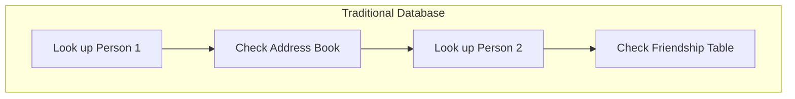
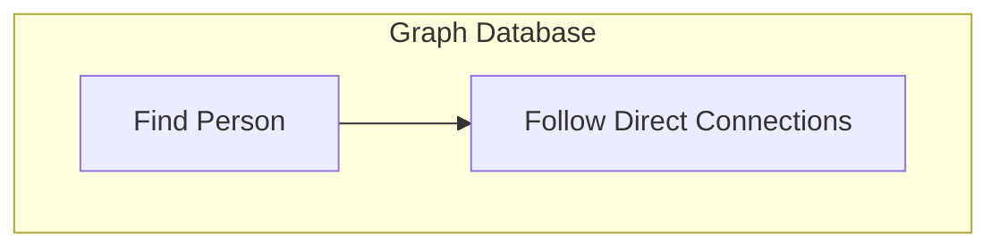
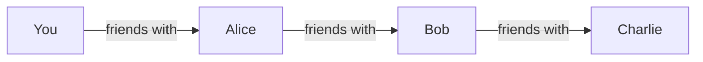
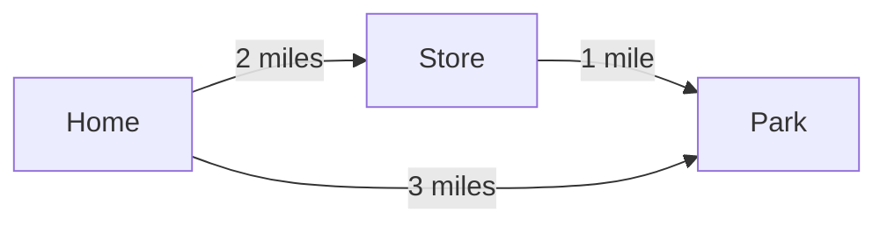
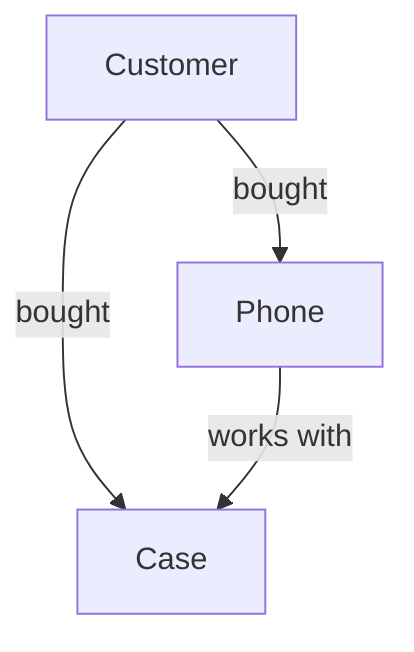

# 🎯 Understanding Graph Databases & Index-Free Adjacency


## 🎓 What Will You Learn?
- How graph databases store and connect data
- Why they're faster for relationship queries
- What makes them different from traditional databases
- Real-world examples you see every day

## 🌟 The Big Idea: Index-Free Adjacency

### Think of it Like...
Imagine you're at a party:

**Traditional Database (RDBMS):**
```
You: "Where's Alice?"
Host: *checks guest list* "She's in the kitchen"
You: "Where's Bob?"
Host: *checks guest list again* "He's in the living room"
You: "Are they friends?"
Host: *checks another list* "Yes, they know each other"
```

**Graph Database:**
```
You: "Where's Alice?"
Host: "She's in the kitchen. Actually, I see her talking to Bob right now!"
```

### 📊 Visual Comparison





## 🔍 How It Works

### Traditional Database (Like a Phone Book)
```
PEOPLE TABLE
--------------
ID | Name  | City
1  | Alice | NYC
2  | Bob   | LA

FRIENDSHIPS TABLE
-----------------
Person1 | Person2
Alice   | Bob
```

### Graph Database (Like a Social Network)
```
    [Alice]---friends_with--->[Bob]
       |                        |
    lives_in               lives_in
       |                        |
    [NYC]                    [LA]
```

## 🚀 Why It's Better: A Real Example

Let's find "friends of friends who live in NYC"

### Traditional Way (Hard! 😓)
```sql
-- Don't worry about understanding this yet!
SELECT p2.name 
FROM people p1 
JOIN friendships f1 ON p1.name = f1.person1
JOIN people p2 ON f1.person2 = p2.name
WHERE p2.city = 'NYC'
```

### Graph Way (Easy! 😊)
```cypher
// Much simpler!
MATCH (person)-[:friends_with]->(friend)-[:lives_in]->(city)
WHERE city.name = 'NYC'
RETURN friend.name
```

## 🌍 Real-World Examples

### 1. Social Networks (Like Facebook)


### 2. GPS Navigation


### 3. Product Recommendations


## 🎮 Try It Yourself!

1. **Download Neo4j Desktop** (It's free!)
   - Visit [Neo4j Download Page](https://neo4j.com/download/)

2. **Create Your First Graph**
   ```cypher
   // Create two friends
   CREATE (john:Person {name: 'John'})
   CREATE (mary:Person {name: 'Mary'})
   CREATE (john)-[:FRIENDS_WITH]->(mary)
   ```

3. **View Your Graph**
   - You'll see something like:
   ```
   (John)--[FRIENDS_WITH]-->(Mary)
   ```

## 📚 What's Next?

1. **Start with Basics**
   - [Neo4j Basics Tutorial](https://neo4j.com/developer/graph-database/)
   - Watch our [Video Series](https://youtube.com/neo4j)

2. **Join the Community**
   - [Neo4j Discord](https://discord.gg/neo4j)
   - [Stack Overflow](https://stackoverflow.com/questions/tagged/neo4j)

3. **Practice**
   - Try building a small social network
   - Map your family tree
   - Create a movie recommendation system

## 🤝 Contributing

Just starting to learn? You can still help!
- Share your learning experience
- Add more examples
- Suggest improvements
- Fix typos

## ✨ Remember

Graph databases are like connecting dots:
- Each dot is a piece of information (node)
- Each line is a relationship
- Following the lines is faster than looking up tables!

## 📝 License
MIT License - Feel free to use and share!

---
Made with 💝 for beginners, by beginners

Remember: Everyone was a beginner once. Don't be afraid to ask questions!
