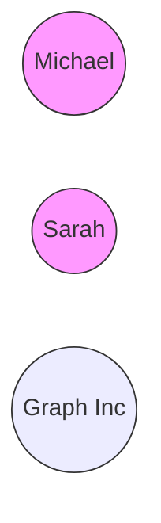
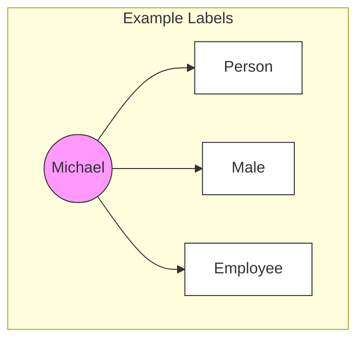
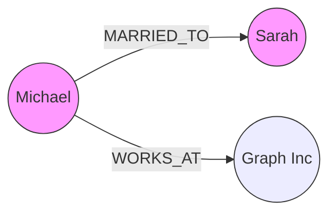
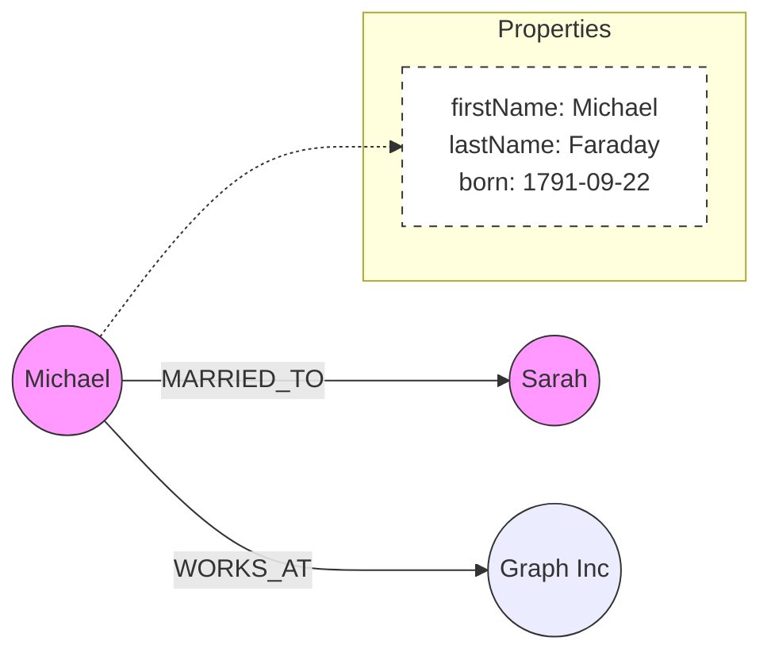

# 🎯 Neo4j Property Graphs: A Beginner's Guide

## 📚 What is a Property Graph?
A Property Graph in Neo4j consists of four main components that work together to create a flexible, connected data structure:
- Nodes (entities)
- Relationships (connections)
- Labels (categories)
- Properties (details)

Let's break each one down!

## 🏗️ Neo4j Graph Elements in Detail

### 1. 🔵 Nodes


Nodes are the core entities in your graph. For example:
- Michael
- Sarah
- Graph Inc

### 2. 🏷️ Labels
Labels help categorize your nodes. A node can have multiple labels!



Common labels from our example:
- Person
- Male
- Female
- Employee
- Company

### 3. 📝 Properties
Properties are key-value pairs that add details to both nodes and relationships. Here's what they look like:

```json
// Michael's Properties
{
    "firstName": "Michael",
    "lastName": "Faraday",
    "born": "1791-09-22"
}

// Graph Inc's Properties
{
    "name": "Graph Inc",
    "city": "London",
    "numEmployees": 56,
    "dba": ["Graph Incorporated", "GI"]
}
```

### 4. ➡️ Relationships
Relationships show how nodes connect and must have:
- A direction
- A type (in UPPERCASE)
- Optional properties



## 🔍 Querying Examples

### Finding Nodes by Label:
```cypher
// Find all Person nodes
MATCH (p:Person)
RETURN p
```

### Finding Specific Nodes by Property:
```cypher
// Find Michael
MATCH (m:Person {firstName: "Michael"})
RETURN m
```

### Finding Connected Nodes:
```cypher
// Find married couples
MATCH (m:Person)-[:MARRIED_TO]->(s:Person)
RETURN m, s
```

### Querying Relationship Properties:
```cypher
// Find marriage dates
MATCH (m:Person)-[r:MARRIED_TO]->(s:Person)
RETURN m.firstName, s.firstName, r.date
```

## 🎨 Complete Example
Here's how all these elements work together:



## 📋 Neo4j Design Principles Summary
1. **Nodes** represent your main entities
2. **Labels** help categorize and find nodes efficiently
3. **Properties** provide detailed information about nodes and relationships
4. **Relationships** always have:
   - A direction
   - A type
   - Optional properties

## 💡 Best Practices
- Use clear, descriptive relationship types
- Add relevant properties to both nodes and relationships
- Use labels to optimize queries
- Think about your data model before creating it

## 🎮 Practice Time!
Try modeling this scenario:
- Create a Person node for "Michael"
- Add appropriate labels (Person, Male, Employee)
- Add properties (firstName, lastName, born)
- Connect Michael to both Sarah and Graph Inc
- Add properties to the MARRIED_TO relationship (like date)

Need help? Just ask in the comments! 😊
