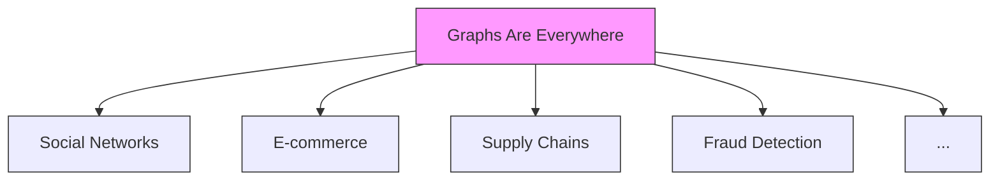
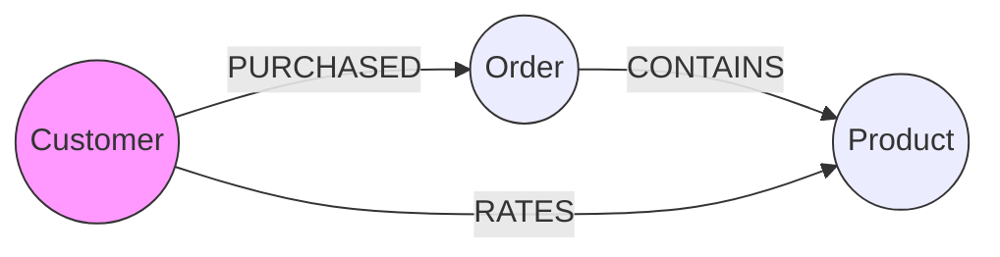
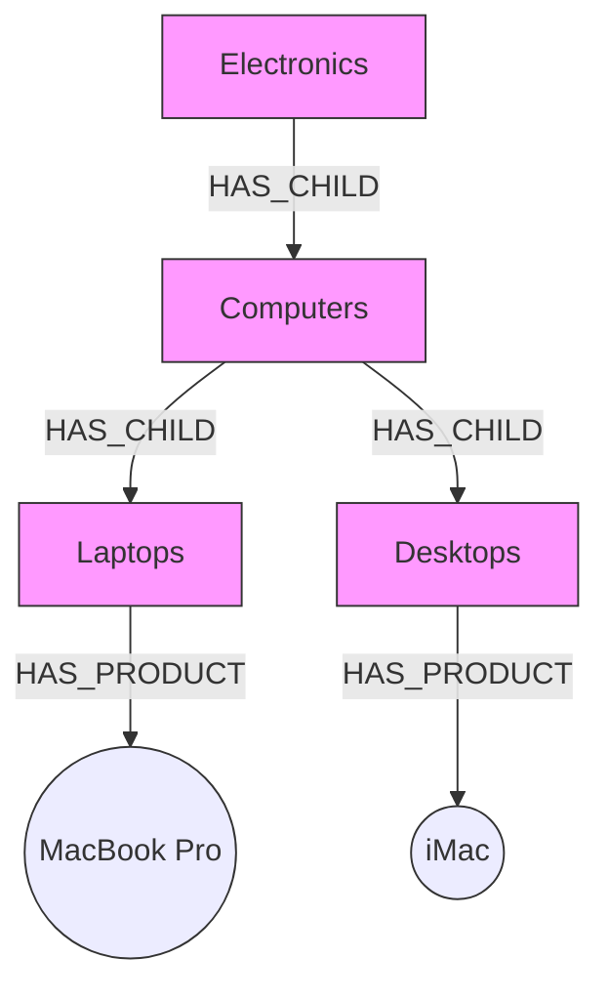
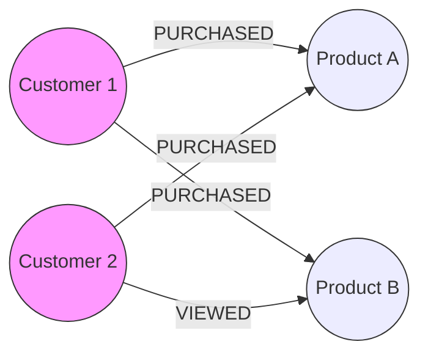
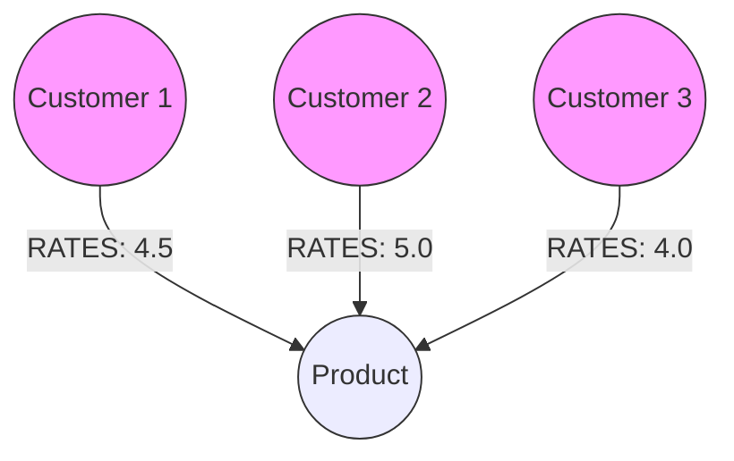

# 🌐 Use Cases for Graphs

## 📊 Graphs Are Everywhere!

> "The world is connected, and graphs help us see how."

Neo4j's "Graphs are Everywhere" concept shows up in:
- Social networks
- Supply chains
- Recommendation systems
- Fraud detection
- And many more!



# 🛍️ E-commerce Use Case Deep Dive

## Core Entities and Relationships



### 🧑‍💼 Customer
- Places orders
- Rates products
- Has purchase history

### 📦 Order
- Links customers to products
- Contains purchase details
- Tracks transaction history

### 🏷️ Product
- Can be purchased
- Receives ratings
- Belongs to categories

## 🔗 Key Relationships

1. **PURCHASED** (Customer → Order)
```json
{
    "date": "2024-01-15",
    "amount": 99.99,
    "status": "completed"
}
```

2. **CONTAINS** (Order → Product)
```json
{
    "quantity": 2,
    "price_at_purchase": 49.99
}
```

3. **RATES** (Customer → Product)
```json
{
    "rating": 4.5,
    "date": "2024-01-20",
    "comment": "Great product!"
}
```

## 🎯 Real-World Applications

### 1. Product Category Hierarchy



#### Traditional SQL vs Neo4j
SQL Query (Complex):
```sql
WITH RECURSIVE CategoryHierarchy AS (
    SELECT id, name, parent_id
    FROM categories
    WHERE parent_id IS NULL
    UNION ALL
    SELECT c.id, c.name, c.parent_id
    FROM categories c
    INNER JOIN CategoryHierarchy ch ON c.parent_id = ch.id
)
SELECT * FROM CategoryHierarchy;
```

Neo4j Cypher (Simple):
```cypher
MATCH (c:Category)-[:HAS_CHILD|HAS_PRODUCT*1..3]->(p:Product)
RETURN p.id, p.title, collect(c.name) AS categories
```

### 2. Recommendation Engine



#### "People Who Bought Also Bought" Query:
```cypher
MATCH (p:Product {id: 'currentProduct'})
<-[:PURCHASED]-(c:Customer)-[:PURCHASED]->(other:Product)
WHERE p <> other
RETURN other.name, count(*) as frequency
ORDER BY frequency DESC
LIMIT 5
```

## 💡 Why Graphs Excel in E-commerce

1. **Real-Time Recommendations**
   - Start from a product
   - Follow customer paths
   - Find similar purchases
   - No batch processing needed

2. **Category Management**
   - Natural hierarchy representation
   - Easy to restructure
   - Efficient queries

3. **Rating Systems**
   - Direct customer-product relationships
   - Easy aggregation
   - Rich metadata storage

## 🎮 Practical Example: Product Rating System




Calculate average rating:
```cypher
MATCH (p:Product {id: 'product123'})<-[r:RATES]-(c:Customer)
RETURN p.name, avg(r.rating) as avgRating, count(r) as numRatings
```

## 📝 Key Takeaways

1. **Simplified Relationships**
   - Natural data modeling
   - Intuitive queries
   - Flexible structure

2. **Performance Benefits**
   - Fast traversal
   - Real-time processing
   - Efficient recommendations

3. **Development Advantages**
   - Clear data model
   - Shorter queries
   - Easier maintenance

Need help implementing any of these patterns? Check out Neo4j's graphgists for more detailed examples! 🚀
