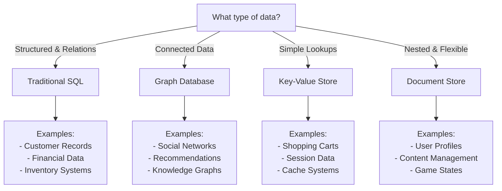
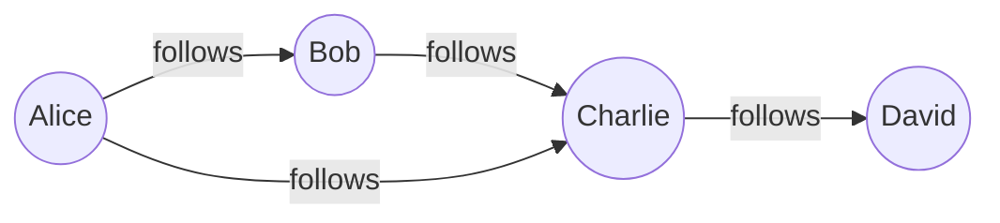
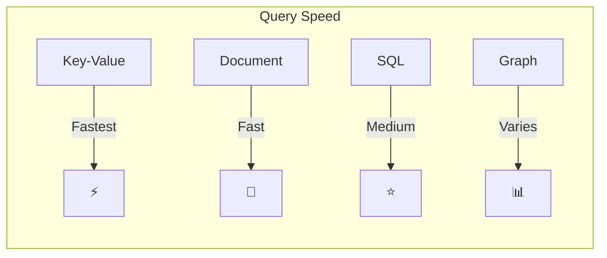
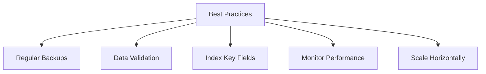

# 🎯 The Ultimate Database Picker: A Visual Guide

## 🌟 Quick Decision Tree



## 💡 Real-World Examples

### 1. E-Commerce Platform

#### Product Catalog (SQL Database) 📦
```sql
CREATE TABLE products (
    id INT PRIMARY KEY,
    name VARCHAR(100),
    price DECIMAL(10,2),
    stock INT,
    category VARCHAR(50)
);
```

**Why SQL?**
- ✅ Structured product data
- ✅ Inventory tracking
- ✅ Price calculations
- ✅ Category management

#### Shopping Cart (Key-Value Store) 🛒
```json
{
  "cart:user123": {
    "items": [
      {"productId": "P789", "quantity": 2},
      {"productId": "P456", "quantity": 1}
    ],
    "lastUpdated": "2024-10-24T10:30:00Z"
  }
}
```

**Why Key-Value?**
- ⚡ Lightning-fast lookups
- 🔄 Frequent updates
- ⏳ Temporary storage
- 🎯 Simple structure

### 2. Social Media App 📱

#### User Profile (Document Store)
```json
{
  "userId": "U123",
  "profile": {
    "name": "Alice Smith",
    "bio": "Tech enthusiast",
    "preferences": {
      "theme": "dark",
      "notifications": true
    },
    "posts": [
      {
        "id": "P1",
        "content": "Hello world!",
        "likes": 42
      }
    ]
  }
}
```

**Why Document Store?**
- 📄 Flexible schema
- 🔄 Easy updates
- 📦 Nested data
- 🚀 Fast reads

#### Friend Network (Graph Database)


**Why Graph DB?**
- 🕸️ Complex relationships
- 🔍 Easy path finding
- 💫 Dynamic connections
- 🎯 Friend suggestions

## 📊 Performance Comparison



## 🎯 Quick Decision Guide

### Choose SQL When You Need:
- 📊 Complex reporting
- 💰 Financial transactions
- 📦 Inventory management
- 🤝 Data relationships

### Choose Key-Value When You Need:
- ⚡ Ultra-fast lookups
- 🛒 Shopping carts
- 🔑 Session management
- 💾 Caching

### Choose Document Store When You Need:
- 📄 Flexible schemas
- 👤 User profiles
- 📝 Content management
- 🎮 Game states

### Choose Graph DB When You Need:
- 🕸️ Social networks
- 🎯 Recommendations
- 🗺️ Route planning
- 🔍 Pattern detection

## 🚀 Best Practices



Remember:
- 🔒 Always implement proper security
- 📈 Plan for scaling
- 🔄 Regular maintenance
- 📝 Document your schema
