# Understanding Database Models and Graph Databases
> A beginner-friendly guide to database modeling concepts with visual examples

## 📚 Table of Contents
- [Introduction](#introduction)
- [Relational vs Graph Databases](#relational-vs-graph-databases)
- [The Northwind Database Example](#the-northwind-database-example)
- [NoSQL to Graph Transformation](#nosql-to-graph-transformation)
- [Key Benefits of Graph Databases](#key-benefits-of-graph-databases)

## Introduction
This guide explores how different database models can be represented as graphs, with a focus on making these concepts accessible to beginners. We'll look at traditional database models and how they compare to graph databases, using clear examples and visual representations.

## Relational vs Graph Databases

### Key Differences:
🔷 **Relational Databases**
- Relationships computed at read-time (using JOIN operations)
- Uses pivot/junction tables for many-to-many relationships
- Query performance degrades as data volume grows
- Complex relationship modeling

🔷 **Graph Databases**
- Relationships stored at write-time
- Direct node-to-node connections
- Consistent query performance regardless of data size
- Natural relationship modeling

### Visual Comparison:

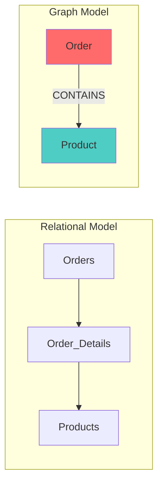

## The Northwind Database Example

### Traditional Relational Model

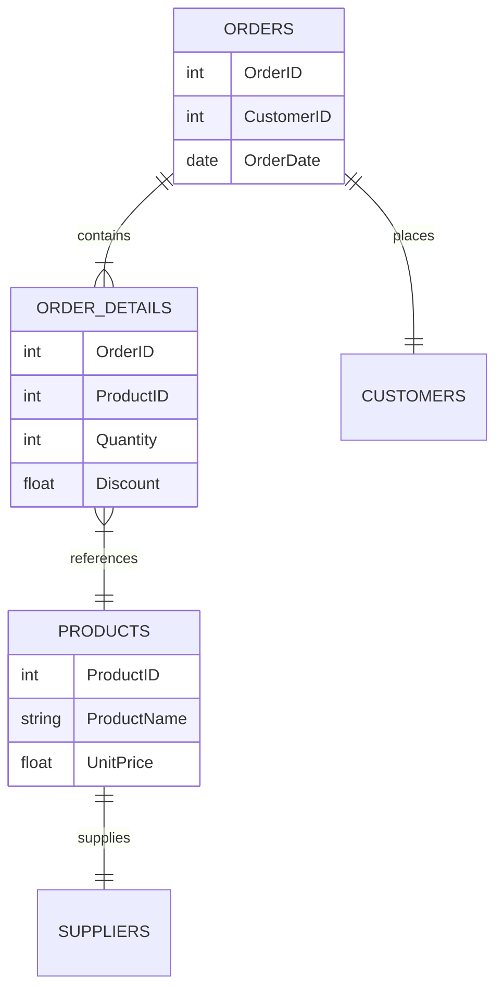

### Graph Model Representation

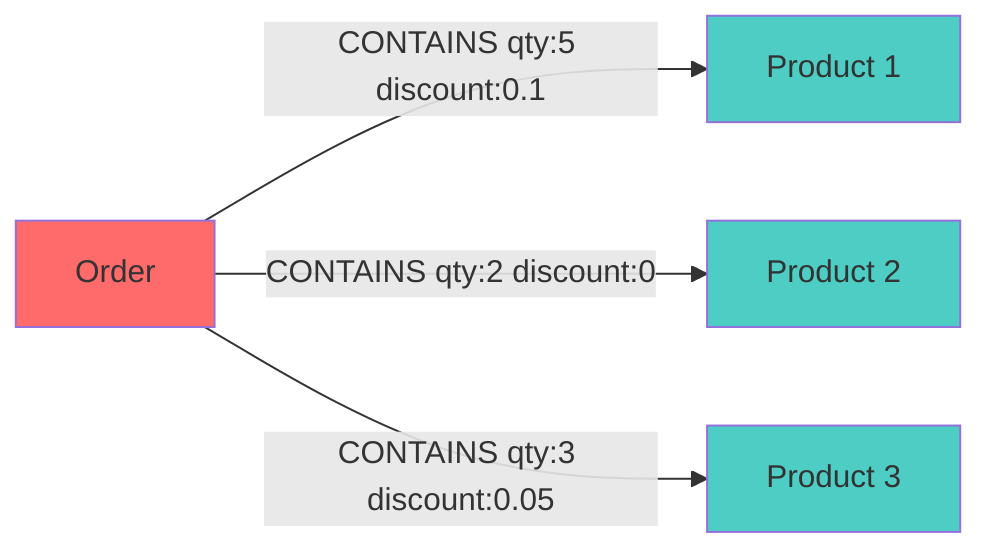

## NoSQL to Graph Transformation

### Key-Value Store Representation

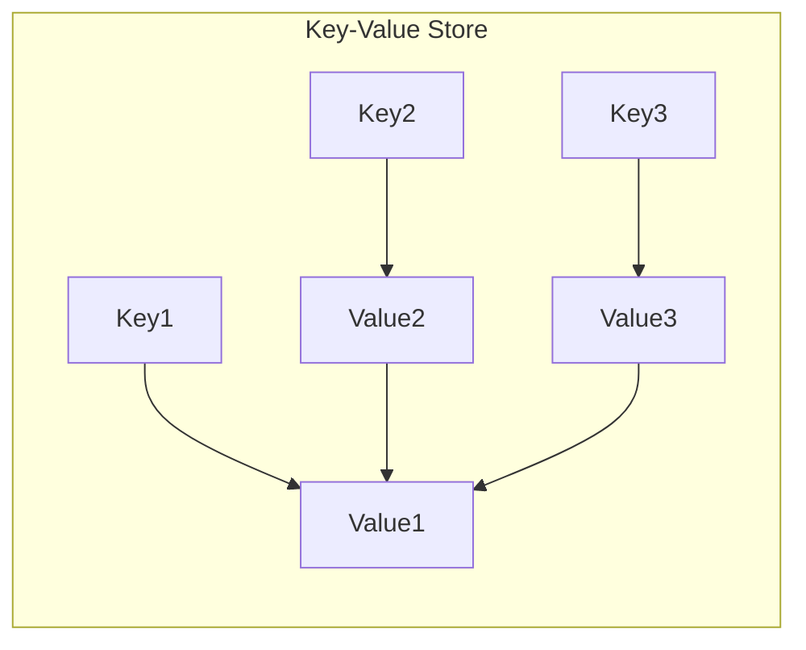

### Document Store Representation

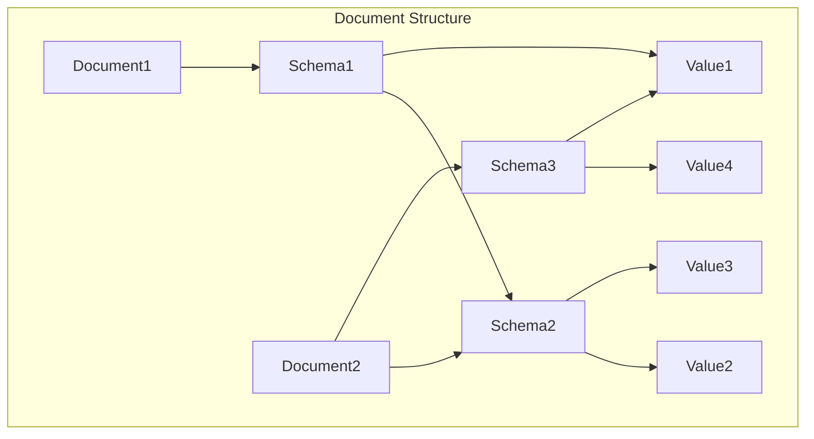

## Key Benefits of Graph Databases

### 1. Performance 🚀
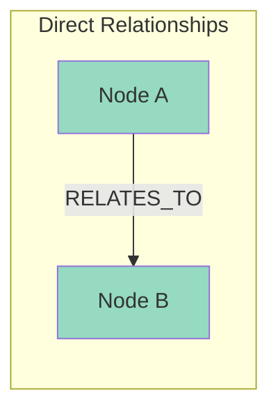

### 2. Flexibility 🔄
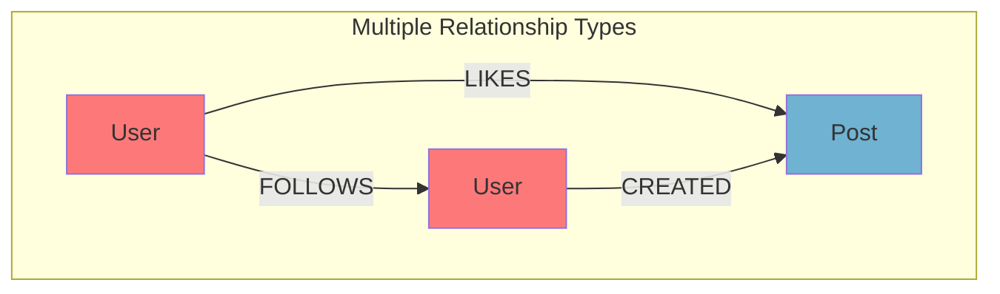

### 3. Natural Modeling 🎯
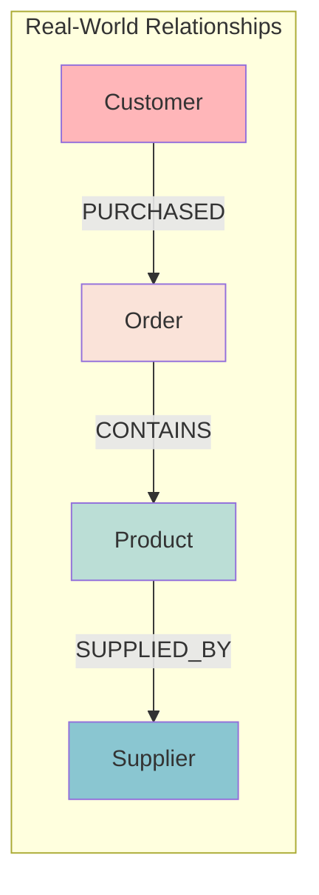

## Example Use Cases

1. **Social Networks**
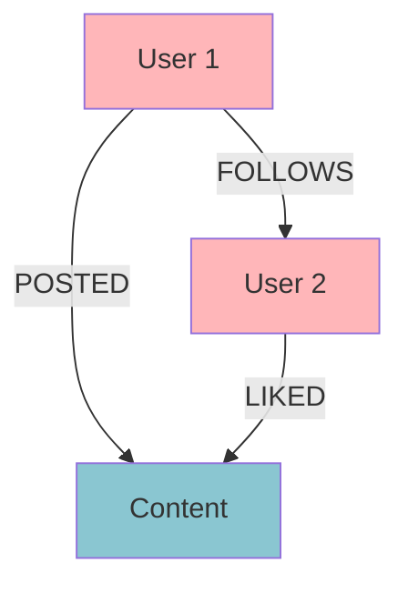

2. **E-commerce**
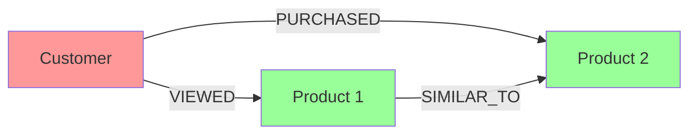

## Best Practices

### Node Design Pattern
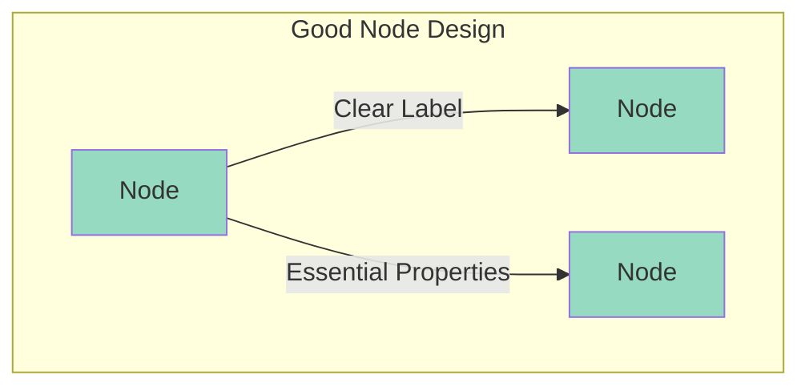

## Further Learning Resources

- [Neo4j Documentation](https://neo4j.com/docs/)
- [Graph Database Fundamentals](https://graphacademy.neo4j.com/)
- [Graph Data Modeling Guidelines](https://neo4j.com/developer/guide-data-modeling/)

---

## Contributing
Feel free to submit issues and enhancement requests!

## License
This document is licensed under the MIT License - see the [LICENSE](LICENSE) file for details.
